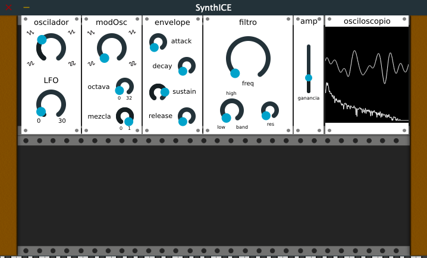

# SynthezICE
Basic synthesizer created using JUCE framework. Contains three oscillators with different signal types, an ADSR envelope, state variable filter and oscilloscope/spectrum analizer.

What i learned:

- Basic understanding of how the Plug-in application development with JUCE framework works.
- Inside understanding of C++ DSP libraries like Maximilian.
- Working with the audio buffer for sending sound out.
- Usage of basic JUCE components like sliders and comboBoxes.
- Linking GUI elements with the audio processor via AudioProcessorValueTreeState.
- Plotting signals from the buffer using Audio Queues.

Most of these things were learned from the JUCE API documentation, tutorials from their webpage and some videos from the AudioProgrammer channel on youtube.
